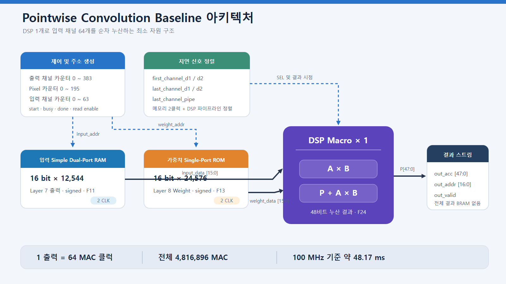
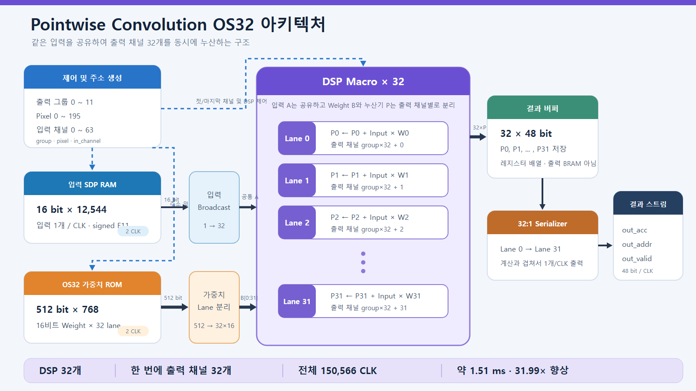

# Layer 8 Pointwise 구조와 검증

## 주소와 연산 순서

입력과 출력은 CHW 순서입니다.

```text
input_addr  = in_channel × 196 + pixel
weight_addr = out_channel × 64 + in_channel
output_addr = out_channel × 196 + pixel
```

Baseline은 `out_channel → pixel → in_channel` 순서로 진행합니다. OS32는 `out_group → pixel → in_channel` 순서로 진행하며 한 group은 연속된 출력 채널 32개입니다.

## BRAM과 DSP 지연

Block Memory Generator는 primitive output register를 사용하므로 주소와 enable을 입력한 뒤 2클럭 후 데이터가 유효합니다. `first_channel_d1/d2`와 `last_channel_d1/d2`는 이 지연에 맞춰 누산 시작과 마지막 입력 채널을 표시합니다. `last_channel_pipe`는 DSP Macro의 결과 지연만큼 마지막 채널 표시를 추가로 이동시켜 최종 P 출력 저장 시점을 맞춥니다.

## 파형 확인 순서

신호는 다음 radix로 확인합니다.

| 신호 | Radix | 확인 내용 |
| --- | --- | --- |
| `clk`, `rst_n`, `start`, `busy`, `done` | Binary | 시작, 동작 구간, 완료 pulse |
| `input_addr`, `weight_addr`, `out_addr` | Unsigned Decimal | 주소 순서와 범위 |
| `in_channel_count`, `pixel_count`, `out_channel_count`/`out_group_count` | Unsigned Decimal | 중첩 반복 순서 |
| `input_data`, `weight_data`/`weight_lane` | Signed Decimal | BRAM 출력과 음수 처리 |
| `dsp_result`, `out_acc` | Hexadecimal | 48비트 bit-true 비교 |
| `out_valid`, `serialize_active`, `serialize_lane` | Binary/Unsigned Decimal | 결과 유효 구간과 OS32 직렬 출력 |

권장 캡처 지점은 다음 세 구간입니다.

1. `start` 직후: 주소 0 요청과 2클럭 뒤 입력·가중치 출력
2. 첫 결과: 마지막 입력 채널 이후 DSP 결과와 `out_valid` 발생
3. 마지막 결과: `out_addr=75263`, 마지막 누산값, `done=1`

## 구조 그림

### Baseline



### OS32



## 다음 확장 방향

현재 OS32는 입력 하나를 출력 채널 32개에 공유해 입력 접근을 줄이지만, 가중치는 픽셀마다 다시 읽습니다. 같은 32개 DSP를 `4 pixels × 8 output channels`로 구성하면 입력 재사용 8회와 가중치 재사용 4회를 동시에 얻을 수 있습니다.

| 32-DSP 구성 | 입력 operand 읽기 | 가중치 operand 읽기 | 합계 |
| --- | ---: | ---: | ---: |
| 1 pixel × 32 output | 150,528 | 4,816,896 | 4,967,424 |
| 2 pixels × 16 output | 301,056 | 2,408,448 | 2,709,504 |
| 4 pixels × 8 output | 602,112 | 1,204,224 | 1,806,336 |
| 8 pixels × 4 output | 1,204,224 | 602,112 | 1,806,336 |

`4×8`은 총 operand 읽기가 최소인 두 구조 중 동시 입력 pixel이 4개뿐이어서 `8×4`보다 입력 RAM banking과 주소 제어가 단순합니다. 이후 Batch Normalization과 ReLU6를 직렬 연결하면 48비트 pointwise 전체 결과를 별도 BRAM에 저장하지 않고 16비트로 재양자화한 값만 다음 계층 버퍼에 저장할 수 있습니다.
